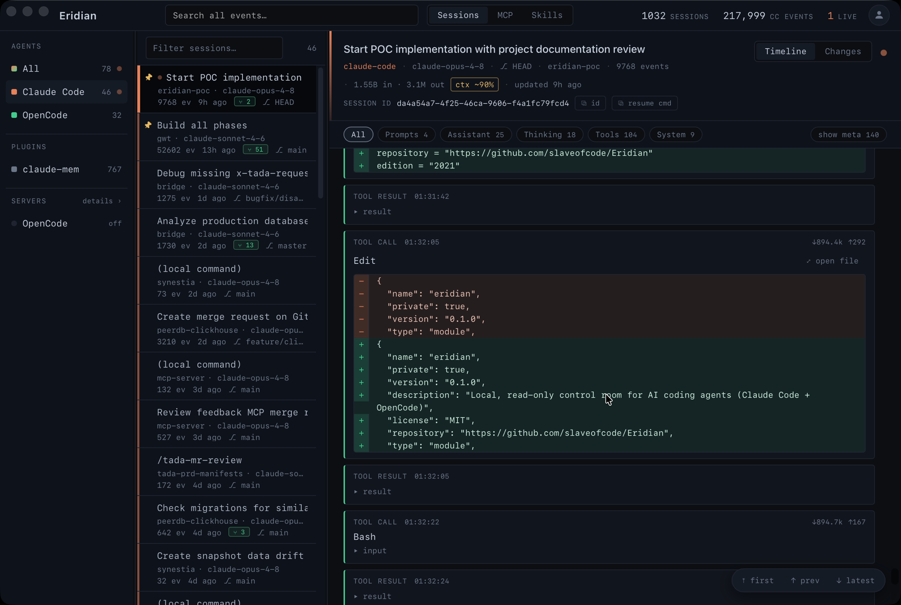

<div align="center">


# Eridian

**One local, read-only control room for your AI coding agents.**

[](https://github.com/slaveofcode/Eridian/actions/workflows/ci.yml)
[](https://github.com/slaveofcode/Eridian/releases)
[](LICENSE)

</div>

Eridian unifies your **Claude Code** and **OpenCode** sessions into a single desktop
app: live session timelines, subagent trees, per-session change inspection (files,
diffs, commands, risk tags), full-text search across all history, a built-in
syntax-highlighted file viewer with git time-travel, token/cost & context-fill
rollups, and a durable local archive that survives the agents' own transcript purges.

It is **strictly read-only** against your agent data and everything stays **on your
machine** — no telemetry, no cloud, no network calls except to a local OpenCode server
you start yourself.



---

## Why

Agent sessions are scattered across `~/.claude/projects/*.jsonl`, an OpenCode server, and
`opencode.db`, in formats that change between releases and get pruned over time. When you
want to review *what an agent actually did* — which files it changed, what commands it ran,
which subagents it spawned, how much context it burned — there's no single place to look.

Eridian is that place. It ingests everything into a local SQLite index (its own,
rebuildable, `0600`-permissioned database), normalizes the differing agent formats behind
one event model, and gives you a fast, searchable, review-oriented UI over all of it.

## Features

- **Unified sessions** — Claude Code ingested live via a filesystem watcher + byte-offset
  tail; OpenCode via REST bootstrap + SSE, plus a read-only cold-import from `opencode.db`
  so history shows even when the server is down. Sessions are grouped by agent, with
  plugin-generated sessions (e.g. claude-mem) in their own section.
- **Timeline** — per-kind cards (prompt / assistant / thinking / tool call + result /
  system), Markdown + XML rendering, kind-filter chips, inline image previews, token &
  context-fill badges, and one-click copy of the session id or a `--resume` command.
- **Change inspection** — per session, split into Subagents / Commands / Files tabs:
  GitHub-style diffs, full-content previews with syntax highlighting, CLI commands with
  heuristic risk tags (danger / notable / safe, clearly labeled as heuristic), a subagent
  activity graph, and a session activity graph. Large sessions paginate.
- **Skill & command detection** — surfaces which skills (the `Skill` tool) and slash
  commands ran in a session.
- **File viewer with time-travel** — open any file, skill, or config in an overlay:
  syntax highlighting + line numbers, Markdown source/rendered toggle, image rendering,
  copy-path, and a **git history picker** to view the file as of any past commit.
- **Full-text search** — FTS5 across every agent's history; jump straight to the event.
- **Token usage** — a per-day usage chart (input incl. cache vs output) over 7/30/90 days.
- **MCP & Skills panels** — read-only, parsed from on-disk config with secrets masked;
  click a row to open the source file at the relevant block.
- **Server control** — start / stop / force-kill an Eridian-managed `opencode serve`
  with live stdout, from the app.
- **Durable archive** — keeps sessions after the agent purges its source transcript, with
  an "archived — source purged" badge; configurable retention and rebuild-from-disk.
- **Resizable, persistent layout** — drag-resize the sidebar and session list; pin
  sessions to the top.
- **Automatic updates** — signed in-app updates; new versions install with one click.

## Use cases

- **Review an agent's work** before you trust it — every file it changed, command it ran,
  and subagent it spawned, with diffs.
- **Audit for risky actions** — surface destructive commands and sensitive-file writes
  across a long session.
- **Find that thing again** — search all your past agent sessions and jump to the moment.
- **Keep a durable record** — retain history after the agents purge their own transcripts.
- **Watch cost & context** — see per-session token/context fill and daily usage.

## Supported agents

| Agent | Live ingest | Offline history |
|---|---|---|
| Claude Code | ✅ filesystem watcher + tail | ✅ (reads `~/.claude/projects`) |
| OpenCode | ✅ REST + SSE (`opencode serve`) | ✅ cold-import from `opencode.db` |

Codex, Gemini CLI, and read-only panels for other agents are on the [roadmap](#roadmap).

## Privacy & safety

These are hard guarantees, enforced in code (see [CLAUDE.md](CLAUDE.md)):

- **Read-only against agent data.** Eridian never writes, renames, or truncates anything
  under `~/.claude/`, `~/.config/opencode/`, or `~/.local/share/opencode/`. Files are
  opened read-only; the OpenCode DB is opened `SQLITE_OPEN_READ_ONLY`. The *only* write
  action is starting/stopping an OpenCode server you explicitly launch from the app.
- **Local only.** No telemetry, no update checks, nothing phones home. The only network
  destination is `http://localhost:<opencode_port>`.
- **Your data stays private.** Transcript bodies are never logged; Eridian's own database
  is created `0600`.

## Install

Download a build from the [**Releases**](https://github.com/slaveofcode/Eridian/releases)
page — macOS (Apple silicon / Intel `.dmg`) and Linux (`.AppImage` / `.deb`) — or
[build from source](#build--run).

> macOS builds aren't Apple-notarized, so macOS quarantines the download and may say the
> app is **"damaged and can't be opened."** It isn't. Move **Eridian.app** to
> **Applications**, then run `xattr -cr /Applications/Eridian.app` and open it normally.
> (For the "damaged" message, right-click → Open does *not* work — use the `xattr` command.)

> **Windows:** builds aren't code-signed, so SmartScreen may warn about an
> **"unrecognized app."** Click **More info → Run anyway** to install.

### Prerequisites

- macOS, Linux, or Windows
- Rust (stable) and [Tauri 2 system dependencies](https://tauri.app/start/prerequisites/)
- Node 20+ and [pnpm](https://pnpm.io/)
- Optional but recommended: Claude Code (transcripts in `~/.claude/projects/`) and/or
  OpenCode

### Build & run

```bash
pnpm install
pnpm tauri dev            # run the app in development
pnpm tauri build          # produce a release bundle
```

## Development

```bash
pnpm tauri dev                              # app (Vite :1420 + Rust)
pnpm test           / pnpm test:cov         # frontend unit tests (Vitest) + coverage
pnpm tsc --noEmit                           # frontend typecheck
cd src-tauri && cargo test                  # Rust tests
cargo clippy -- -D warnings                 # Rust lint
cargo cov / cargo cov-gate                  # Rust coverage (cargo-llvm-cov)
```

Logic modules are covered to **≥90%** on both sides (gate: `pnpm test:cov`, `cargo
cov-gate`). Some tests read your real agent data and are `#[ignore]`d by default:

```bash
cd src-tauri
cargo test real_backfill           -- --ignored   # Claude Code backfill (large)
cargo test opencode_live_bootstrap -- --ignored   # needs `opencode serve` running
cargo test cold_import_real        -- --ignored   # reads ~/.local/share/opencode/opencode.db
```

See [CONTRIBUTING.md](CONTRIBUTING.md) for architecture, conventions, and how to extend
the ingesters.

## Architecture (one paragraph)

Each ingester normalizes its agent's format into one shared event model at the edge, then
writes to a single-writer SQLite store (WAL, FTS5, atomic batches). The Rust core exposes
a read-only Tauri command surface; the React UI reads *only* through those commands and
receives live updates via events — it never touches agent files directly. Full map in
[CONTRIBUTING.md](CONTRIBUTING.md).

## Roadmap

- **Now:** Claude Code + OpenCode, full change inspection, search, time-travel viewer,
  daily token usage.
- **Next:** packaged releases (signed builds + CI); per-commit diff in the viewer.
- **More agents:** Codex (JSONL rollouts), Gemini CLI, read-only panels for
  Antigravity / Claude Desktop.
- **Later (opt-in, carefully):** config assistance (MCP config sync, key management via
  the OS keychain) — only after the read-only foundation is rock-solid.

## Design

Ops-console, not SaaS dashboard: near-black slate base, monospace-first data typography,
and agent-colored identity accents only — Claude Code coral `#E8825A`, OpenCode green
`#3ECF8E`, subagent violet `#A98CFF`, one shared alert amber `#E7B75F`.

## Contributing

Contributions are welcome — see [CONTRIBUTING.md](CONTRIBUTING.md). Please keep the
read-only and local-only guarantees intact; they are the point of the project.

## License

[MIT](LICENSE) © Kresna
